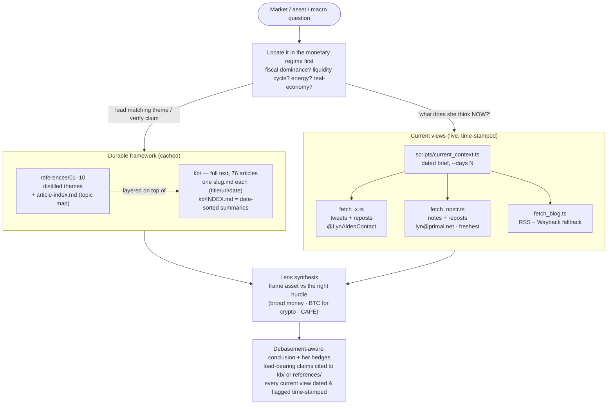

# investor-lyn-alden — architecture

The **Lyn Alden macro lens**: answer a market/asset question through her framework
(fiscal dominance, currency debasement, broad-money inflation, eurodollar system,
energy/EROI, Bitcoin-as-hurdle, scarce-asset allocation). `SKILL.md` is the agent-facing
spec; this file is the map of how the pieces fit.

Three knowledge layers feed one synthesis: **distilled framework** (`references/`),
**full primary source** (`kb/`), and **her current views** (live `scripts/`).

## Architecture



## Knowledge layers

| Layer | Path | Role | When to use |
|---|---|---|---|
| Distilled themes | `references/01`–`10` + `article-index.md` | the framework, one file per theme | framework / theme overview; routing |
| Full archive | `kb/<slug>.md` + `kb/INDEX.md` | primary-source text of all 76 articles | quoting / verifying a load-bearing claim |
| Live feeds | `scripts/current_context.ts` | her current macro takes (X · Nostr · blog) | "what does she think *now*", current positioning |

## Live-context scripts (Bun/TS, zero npm deps)

Run the orchestrator (defaults to last 30 days); each source degrades to a loud
`[UNAVAILABLE]` so one dead feed never blocks the others:

```bash
bun .agents/skills/investor-lyn-alden/scripts/current_context.ts --days 30   # --json for structured
```

| Script | Source | Pulls | Notes |
|---|---|---|---|
| `fetch_x.ts` | syndication.twitter.com (keyless) | recent tweets **+ reposts** | parses `__NEXT_DATA__`; 429s intermittently — re-run |
| `fetch_nostr.ts` | `wss://relay.primal.net` | recent notes **+ reposts** | most reliable + freshest (often same-day) |
| `fetch_blog.ts` | lynalden.com RSS → Internet Archive | public posts/newsletters | live site WAF-blocks datacenter IPs → Wayback fallback; public feed is sparse |
| `current_context.ts` | all three | dated markdown / JSON brief | the entry point |
| `build_kb.ts` | lynalden.com articles | rebuilds `kb/` | run when she publishes new pieces |

**Filter for macro signal** — her social feeds mix macro takes with personal/book posts;
keep the monetary/market-relevant items, ignore the noise.

## Honesty rules (from SKILL.md)

It's a **lens, not gospel** — present as "Alden's framework says…", carry her hedges, and
date every current/tactical claim (she can be and has been wrong). Newsletters and posts
decay: re-ground anything current via `current_context.ts`, never a cached stance.
