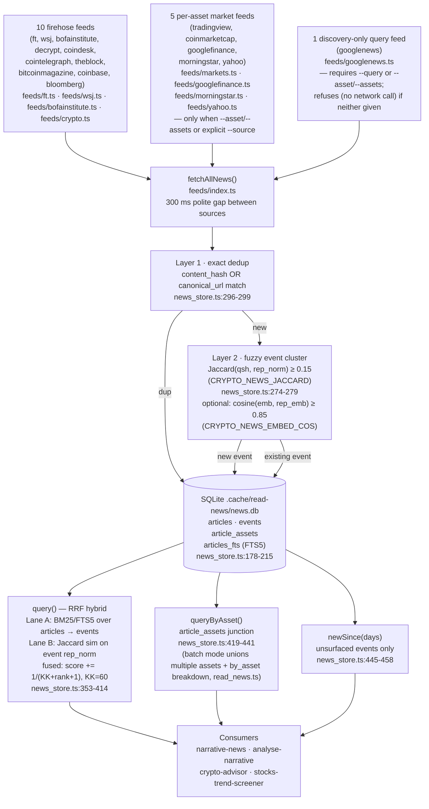

# read-news

Local-first news cache that pulls 10 RSS/HTML firehose feeds plus 5 per-asset market sources (plus 1 discovery-only query source), deduplicates articles by exact URL/hash, clusters same-story multi-outlet coverage into events via fuzzy Jaccard similarity, tags articles by asset, and serves hybrid BM25+Jaccard+recency retrieval via Reciprocal Rank Fusion. Zero runtime deps: Bun + TypeScript + `bun:sqlite` (no npm packages). Educational tooling — see `SKILL.md` for agent-facing usage.

> Entitlement-gated sources (JPMorgan, BofA Global Research sell-side) are `[UNAVAILABLE - license required]` — no endpoint, no scraping, no paywall bypass; Seeking Alpha is explicitly excluded and will not be added. The public Bank of America **Institute** macro/consumer research feed (`bofainstitute`) is a different, non-gated product — see `SKILL.md`'s "Source classes and access limits" for the full statement distinguishing the two.

## Architecture

## Feed registry

| Source | Kind | Endpoint / URL | Browser? | Asset tagging | Paywall |
|---|---|---|---|---|---|
| `ft` | firehose | `https://www.ft.com/<section>?format=rss` | No | none | teaser or `[UNAVAILABLE - paywall]` (ft.ts:126) |
| `wsj` | firehose | `https://feeds.a.dj.com/rss/<feed>.xml` | No | none | teaser or `[UNAVAILABLE - paywall]` (wsj.ts:143) |
| `bofainstitute` | firehose, **higher-authority** | `institute.bankofamerica.com` sitemap.xml → per-page `<title>`/`<meta description>` scrape (bofainstitute.ts) | No | none | `body` always `null` (client-rendered content); public BofA **Institute** macro/consumer research — not BofA Global Research (sell-side, entitlement-gated, see below); `published_at` is `null` (`date_provenance: "unavailable"`) on every page today since BofA Institute publishes no `datePublished` metadata — never fetch time or the sitemap `<lastmod>`, see "Date semantics" below |
| `decrypt` | firehose | `https://decrypt.co/feed` | No | none | full body in `content:encoded` |
| `coindesk` | firehose | `https://www.coindesk.com/arc/outboundfeeds/rss/` | No | none | full body in `content:encoded` |
| `cointelegraph` | firehose | `https://cointelegraph.com/rss` | No | none | full body in `content:encoded` |
| `theblock` | firehose | `https://www.theblock.co/rss.xml` | No | none | summary only |
| `bitcoinmagazine` | firehose | `https://bitcoinmagazine.com/feed` | No | none | full body in `content:encoded` |
| `coinbase` | firehose | Google News proxy (direct site is Cloudflare-gated) | No | none | summary only |
| `bloomberg` | firehose | `https://www.bloomberg.com/feed/podcast/etf-report.xml` (podcast; often 403) | No | none | summary only |
| `tradingview` | per-asset | `https://news-headlines.tradingview.com/v2/headlines?symbol=<sym>` + `/v3/story?id=` | No | `relatedSymbols` → `tvSymbolToAsset()` (markets.ts:33) | no paywall |
| `coinmarketcap` | per-asset | `/data-api/v3/cryptocurrency/detail/lite?slug=` → `/content/v3/news?coins=<id>` | No | explicit asset from query (markets.ts:41) | no paywall |
| `googlefinance` | per-asset | `https://www.google.com/finance/quote/<sym>` HTML scrape | No | ticker from symbol arg (googlefinance.ts) | filters to known news domains only |
| `morningstar` | per-asset | Morningstar quote-page HTML scrape (`resolveExchange()` → page URL) | No | ticker from symbol arg (morningstar.ts) | headline only |
| `yahoo` | per-asset | `https://feeds.finance.yahoo.com/rss/2.0/headline?s=<sym>` RSS | No | full requested symbol list tagged (imprecise on multi-symbol batch requests, same caveat as CMC) (yahoo.ts) | teaser or `[UNAVAILABLE - no teaser in feed]` |
| `googlenews` | discovery-only (query/topic-scoped, not ticker-driven) | `https://news.google.com/rss/search?q=<query>+(site:...)` restricted to Bloomberg/Reuters/Business Insider/CNBC/IBD (googlenews.ts) | No | none — always `assets: []` | N/A — `body` always `null`, link is an opaque Google redirect, never a resolved citation |

## Storage & dedup

**Schema** (news_store.ts:178–215):
- `events` — one row per clustered story: `event_cluster_id`, `rep_simhash`, `rep_norm` (normalized text of representative article), `rep_embedding` (optional JSON float array), `title`, `first_seen`, `last_updated`, `sources` (JSON array), `source_count`, `materiality`, `priced_in`, `surfaced_to_panel_on`
- `articles` — raw articles: `event_id` FK → events, `canonical_url`, `content_hash`, `simhash`, `assets` (JSON), indexed on `canonical_url` and `content_hash`
- `article_assets` — junction: `(article_id, asset)` with indexes on both columns (news_store.ts:204–209)
- `articles_fts` — FTS5 virtual table over `(title, summary)`, content-rowid linked to `articles.id`, populated by `art_ai` INSERT trigger (news_store.ts:210–214)

**Layer 1 — exact dedup** (`ingest()`, news_store.ts:296–299): rejects any article whose `content_hash` or non-empty `canonical_url` already exists. Returns `duplicate++`, skips.

**Layer 2 — event clustering** (`findEvent()`, news_store.ts:261–280): computes word+bigram shingles (`JAC_NGRAM=2`) and Jaccard similarity against every event's `rep_norm`. Default threshold `DEFAULT_JACCARD = 0.15` (news_store.ts:17), overridden by `CRYPTO_NEWS_JACCARD`. If an embedding command is set, cosine ≥ `CRYPTO_NEWS_EMBED_COS` (default `0.85`, news_store.ts:263) short-circuits to an immediate cluster match.

Dedup unit behavior (news_store.test.ts:280, 369):
- Single article + URL-dupe → `{ new: 1, duplicate: 1, events_touched: 0 }` (L1 exact-dup)
- 3 similar articles (same event) → `{ new: 3, duplicate: 0, events_touched: 2 }`, 1 event with `source_count: 3` (L2 cluster)

## Date semantics — `published_at` vs `date_provenance`

`Article.published_at` (types.ts) is `string | null` — an ISO datetime of a **verified publisher
date**, or `null` when no such date exists on the source. It is never a fetch/ingest-time
substitute: a fetcher must not paper over a missing publisher date by writing `new Date()`. The
optional `Article.date_provenance` field is `"source"` (a real parsed date — implied when the
field is omitted, since every pre-existing feed always supplies one) or `"unavailable"` (no
publisher date could be found; `published_at` must be `null`).

`ingest()` (news_store.ts) honors this split end-to-end:
- **`articles.published_at`** (the column consumers read as "this article's publication time")
  stores the verified date, or SQL `NULL` when `date_provenance === "unavailable"` — never
  ingestion time. The `articles` schema already allows `NULL` here (no migration needed).
- **A new event's `first_seen`** (its own "when did our system first see this story" bookkeeping —
  a distinct, legitimately-ours concern, not a claim about publisher time) still honestly falls
  back to ingestion time when the founding article's date is unknown, since that genuinely is when
  we saw it.
- **`recentArticles()`**'s `published_at >= cutoff` filter naturally excludes `NULL`-dated rows
  (SQLite treats any comparison against `NULL` as unknown) — an article with no verified date is
  never backfilled into a "recent" listing just to pass the filter.

**Bank of America Institute (`bofainstitute`) is the canonical example**: institute.bankofamerica.com
pages carry no `datePublished`/`article:published_time`/similar metadata as of 2026-07 inspection.
The sitemap's own `<lastmod>` is an UPDATE timestamp, not a publication date, and is used *only* as a
freshness hint to pick which candidate pages to fetch — it is never stored on the `Article` or
presented as `published_at`. When a page has no verifiable date, `bofainstitute.ts` sets
`published_at: null`, `date_provenance: "unavailable"`, and keeps the article (dropping every
dateless page would make a real, valuable primary-source feed useless). This gap is surfaced
per-article, in-band, via those two fields — and is deliberately never pushed into the fetcher's
`errors` array or `read_news.ts`'s top-level `unavailable` array / `feeds_ok` count, because an
unverifiable publisher date is not a fetch failure: the fetch succeeded and a real (honestly
null-dated) article was returned, so treating it as a broken feed would misrepresent a successful
fetch. See `feeds/bofainstitute.ts`'s file header and `feeds/bofainstitute.test.ts` (live-network
regression guard) for the full rationale.

## Retrieval

**`query(db, q, {days?, k?})`** (news_store.ts:353–414) — RRF hybrid:
- Lane A: `articles_fts MATCH ?` BM25 → deduplicated event IDs in BM25 order
- Lane B: shingle-Jaccard rank of all events against normalized query
- Fusion: `score[eid] += 1 / (KK + rank + 1)` where `KK = 60` (news_store.ts:385), sorted descending, capped at `k` (default 15), filtered by `last_updated >= now − days`
- **Authority bonus**: events citing a source in `AUTHORITATIVE_SOURCES` (currently just `bofainstitute`, the public BofA Institute macro/consumer research feed) get an additive `AUTHORITY_BONUS = 0.005` on top of the fused score — a bounded nudge (~30% of one RRF rank term) that can reorder near-ties among already-relevant results but cannot promote an irrelevant authoritative-source match over a clearly better one. Also surfaced as `authoritative: boolean` on every `EventRecord`. Does not affect dedup/clustering or `source_count`.

**`queryByAsset(db, asset, {days?, k?})`** (news_store.ts:419–441): joins `article_assets` → `articles` → `events` for the given ticker symbol; returns events ordered by `last_updated DESC`.

**`newSince(db, days)`** (news_store.ts:445–458): returns events where `surfaced_to_panel_on IS NULL` and `first_seen` or `last_updated` within the window. `markSurfaced()` stamps the date to prevent re-alerting (news_store.ts:462–476).

**Optional dense vectors**: set `CRYPTO_NEWS_EMBED_CMD` to a shell command that reads text from stdin and prints a JSON float array to stdout. When set, `embed()` (news_store.ts:149–163) is called on ingest and `findEvent()` uses cosine similarity as a fast-path cluster check before Jaccard.

## CLI

**`bun scripts/read_news.ts [flags]`** (read_news.ts)

| Flag | Purpose | Default |
|---|---|---|
| `--db <path>` | SQLite DB path (overrides `CRYPTO_NEWS_DB`) | `.cache/read-news/news.db` |
| `--days <n>` | Recency window for result filtering (also the Google News `when:Nd` window) | `3` |
| `--k <n>` | Max events returned | `15` |
| `--query <str>` | RRF hybrid text query → `query()`; also the Google News search topic when `--source googlenews` is set | — (uses `newSince` if absent) |
| `--source <csv>` | Comma-separated source names to fetch | all `NEWS_FEEDS` |
| `--asset <SYM>` | Also fetches the 5 per-asset sources (TradingView, CoinMarketCap, Google Finance, Morningstar, Yahoo) for symbol; routes to `queryByAsset()` | — |
| `--assets <csv>` | Batch form of `--asset` — CSV of symbols; merged with `--asset` (deduped, uppercased) | — |
| `--equities-only` | Opt-in filter for an `--asset`/`--assets` run: drops CoinMarketCap and the 6 crypto-only RSS firehose feeds, unless `--source` was explicitly passed (explicit `--source` always wins) | off |

Output JSON: `{ fetched, feeds_ok, unavailable, events, by_asset? }`.

`by_asset` is additive and only present when `--assets`/`--asset` together resolve to **more than one**
distinct symbol: it's a `Record<symbol, EventRecord[]>` breakdown of `queryByAsset()` results per requested
asset, alongside the flat `events` array (which is the deduped union of all `by_asset` values by
`event_cluster_id`, for consumers that don't care about the per-asset split). The single-asset `--asset X`
path (or `--assets X` with exactly one symbol) is unchanged — `events` is `queryByAsset(db, X, ...)` directly
and `by_asset` is omitted.

### Environment variables

| Variable | Purpose | Default |
|---|---|---|
| `CRYPTO_NEWS_DB` | SQLite DB path | `.cache/read-news/news.db` (news_store.ts:15, read_news.ts:60) |
| `CRYPTO_NEWS_EMBED_CMD` | Shell command: stdin=text → stdout=JSON float array | _(unset — embeddings disabled)_ (news_store.ts:150) |
| `CRYPTO_NEWS_JACCARD` | Jaccard similarity threshold for event clustering | `0.15` (news_store.ts:17,264) |
| `CRYPTO_NEWS_EMBED_COS` | Cosine similarity threshold for dense-vector cluster match | `0.85` (news_store.ts:263) |

## Adding a feed

1. **Write fetcher** `scripts/feeds/<name>.ts` returning `Article[]` (types.ts:10). Required fields: `source`, `url`, `title`, `summary`, `body` (null if unavailable), `published_at`, `lang`, `tags`, `assets`. `published_at` is the ISO datetime of a **verified publisher-provided** publication date — parsed from real feed/page data (RSS `pubDate`, JSON-LD `datePublished`, etc.), never a fetch/ingest-time substitute. Set it to `null` (with optional `date_provenance: "unavailable"`) when the source has no such date at all — see "Date semantics" below. Never fabricate body; emit `[UNAVAILABLE - paywall]` in `summary` when no teaser exists.
2. **Register in `feeds/index.ts`**: firehose feeds go in `NEWS_FEEDS` and get a `fetchCryptoFeed`-style branch in `fetchAllNews`. Per-asset feeds go in `MARKET_SOURCES` and require an asset loop (see `tradingview`/`coinmarketcap`/`googlefinance`/`morningstar`/`yahoo`). Free-text discovery/search feeds (query- or topic-scoped, not purely ticker-driven — see `googlenews`) go in `QUERY_SOURCES` instead and must refuse (`[UNAVAILABLE]`, no network call) rather than silently substituting a default ticker list when called with neither `opts.query` nor an explicit `opts.assets`. Firehose = global macro/crypto; per-asset = fetched once per symbol per run; query = fetched once per explicit query/topic.
3. **Add `<name>.test.ts`** alongside the fetcher.
4. **Keep golden-parity tests green** — `news_store.test.ts:768` defines the real gate: `GOLDEN_INGEST = { new: 15, duplicate: 1, events_touched: 2 }`. This reproduces the retired Python `news_store.py`'s exact dedup counts over a frozen parity fixture. The snapshot also covers `GOLDEN_NEW_SINCE_TITLES` (13 titles) and `GOLDEN_QUERY_TOP5` (lines 769–790). Additive schema changes must not alter any of these frozen values — e.g. the `bofainstitute` firehose feed and its `AUTHORITATIVE_SOURCES`/`authoritative`/`AUTHORITY_BONUS` ranking addition touch `news_store.ts` directly but were verified not to change any golden value (none of the golden fixture's sources are in `AUTHORITATIVE_SOURCES`).

## Consumers

- **`narrative-news`** — primary crypto panel gather seat; calls `read_news.ts` and emits the new/updated events for the consolidated brief (narrative-news/SKILL.md:18)
- **`analyse-narrative`** — interpretation layer; runs `read_news.ts` first as single entry point for all news sources, then classifies events PRICED_IN vs ACTIONABLE_CONTEXT (analyse-narrative/SKILL.md:65)
- **`crypto-advisor`** — cites feed-script records (FT/WSJ/read_news.ts) as source-of-truth; hard rule against fabricating headlines (crypto-advisor/SKILL.md:170)
- **`stocks-trend-screener`** — uses `read_news.ts` for a deterministic firm-wide macro feed (stocks-trend-screener/SKILL.md:126)
- **`analyse-sellside`** — separate skill, NOT a consumer of this pipeline: it fetches structured sell-side data (analyst ratings, price targets, fair-value/moat) directly via `web_fetch`. `read-news`'s Morningstar/Google-Finance fetchers only ever return news headlines, never that structured data — see `SKILL.md`'s boundary note.

## Layout

| Path | What |
|---|---|
| `SKILL.md` | Agent-facing usage: commands, flags, fallback paths, hard rules |
| `README.md` | This file — maintainer architecture reference |
| `scripts/news_store.ts` | Storage engine: schema, `ingest`, `query`, `queryByAsset`, `newSince`, `markSurfaced`, SimHash, Jaccard, RRF |
| `scripts/read_news.ts` | CLI entry: arg parsing (`parseCliArgsFromTokens`), `runReadNews`, wires fetchAllNews → ingest → query, `--asset`/`--assets` batch handling, `--equities-only` filter, `by_asset` output |
| `scripts/types.ts` | `Article` type, `parseRSS`, `stripHtml`, `toISO`, `shortHash`, `fetchWaybackBody` |
| `scripts/feeds/index.ts` | Feed registry: `NEWS_FEEDS`, `CRYPTO_SOURCES`, `GOOGLENEWS_DEFAULT_PUBLISHERS`, `fetchAllNews`, source dispatch (firehose / per-asset `MARKET_SOURCES` / discovery-only `QUERY_SOURCES`) |
| `scripts/feeds/crypto.ts` | 7 crypto RSS sources (`CRYPTO_FEED_URLS`) |
| `scripts/feeds/ft.ts` | FT section RSS fetcher; paywall-honest |
| `scripts/feeds/wsj.ts` | WSJ RSS fetcher; paywall-honest |
| `scripts/feeds/markets.ts` | TradingView, CoinMarketCap per-asset fetchers (`DEFAULT_MARKET_ASSETS`, `flattenTvAst`, `tvSymbolToAsset`, `mapCmcItem`) |
| `scripts/feeds/googlefinance.ts` | Google Finance per-asset fetcher (HTML scrape) |
| `scripts/feeds/morningstar.ts` | Morningstar per-asset fetcher (HTML scrape) |
| `scripts/feeds/yahoo.ts` | Yahoo Finance per-asset fetcher (`fetchYahooNews`, RSS) |
| `scripts/feeds/googlenews.ts` | Google News discovery-only fetcher (`fetchGoogleNews`, `PUBLISHER_DOMAINS`, publisher-whitelisted RSS search) |
| `scripts/feeds/*.test.ts` | Per-fetcher unit tests |
| `scripts/news_store.test.ts` | Storage unit tests incl. golden-parity ingest counts |
| `scripts/read_news.test.ts` | CLI integration test, incl. `parseCliArgsFromTokens` regression tests |
