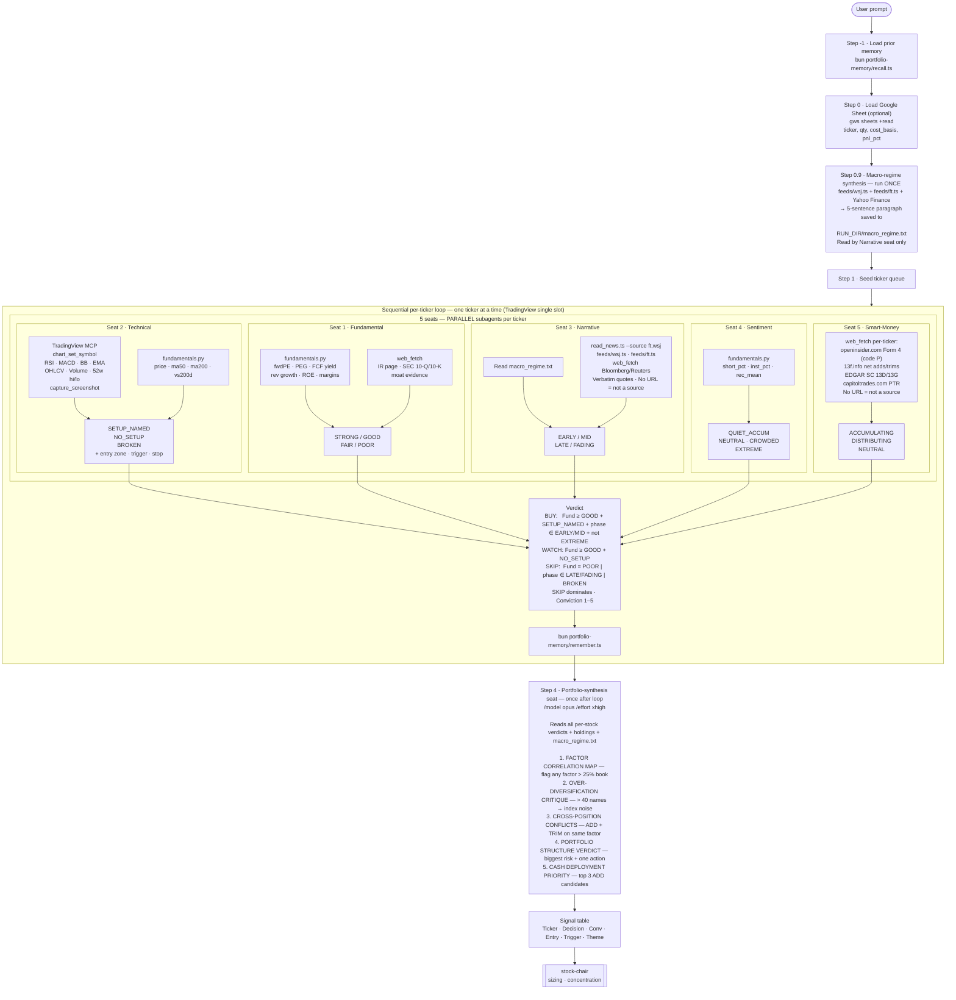

# stocks-advisor

Analyzes individual stocks one at a time — runs a **5-seat analyst panel** (fundamental / technical / narrative / sentiment / smart-money) per stock and outputs a concrete **entry plan** (price zone + bar-close trigger + market-based stop) with a **BUY / WATCH / SKIP** decision.

For portfolio reviews: outputs HOLD / ADD / TRIM / EXIT per position with a tax-harvest table, cash deployment plan, and a cross-portfolio synthesis seat.

Input: user-supplied ticker list, a Google Sheet of holdings, or stocks discovered live from a named market theme.

> Educational analysis, not financial advice. Single stocks are satellites; the index is the bar.

## Architecture



## Two input modes

| Mode | Input | Verdicts |
|---|---|---|
| **Watchlist / Theme discovery** | Explicit tickers or live theme discovery | BUY / WATCH / SKIP |
| **Portfolio review** | Google Sheet URL (holdings + cost basis) | HOLD / ADD / TRIM / EXIT + tax-harvest table + portfolio synthesis |

## The 5 seats

| Seat | Lens | Data source | Output |
|---|---|---|---|
| **Fundamental** | FCF yield, PE, PEG, margins, moat — margin of safety at current price? | Injected (yfinance) | STRONG / GOOD / FAIR / POOR |
| **Technical** (Bernstein STF) | Set-Up → Trigger → Follow-Through. Named setup + bar-close trigger + market-based stop. No trigger = no trade. | Injected (TradingView) | SETUP_NAMED / NO_SETUP / BROKEN |
| **Narrative / Macro** | Theme phase + macro-regime context. `read_news.ts` for discovery; feed scripts for verbatim citation. No fabrication. | Injected + live news | EARLY / MID / LATE / FADING |
| **Sentiment** | Contrarian read: short%, institutional%, analyst consensus, RSI extension | Injected (yfinance) | QUIET_ACCUM / NEUTRAL / CROWDED / EXTREME |
| **Smart-Money** | Disclosed flows: Form 4 (openinsider), 13F (13f.info), 13D (EDGAR), PTR (capitoltrades). ≥2 classes agreeing → verdict. | Live web_fetch | ACCUMULATING / DISTRIBUTING / NEUTRAL |

## Step 0.9 — Macro-regime synthesis

Runs **once** before the per-stock loop. Produces a shared 5-sentence paragraph injected into every seat's data package:

| Dimension | Content |
|---|---|
| Fed/rates | Fed stance + next meeting expectation + one named CME/FOMC data point |
| Growth/earnings | Current earnings season signal or GDP read, specific number |
| Inflation | Latest CPI/PCE print with date |
| Geopolitics | Single most market-relevant geopolitical fact this week |
| Liquidity/risk appetite | Equity trend + vol signal (VIX level, index weekly move) |

Anti-hallucination rule: every sentence names a source and a specific, dateable fact. No training-memory claims.

## Step 4 — Portfolio-synthesis seat

Runs **once** after the per-stock loop completes. A single `/model opus /effort xhigh` subagent that reasons across all positions simultaneously — the cross-portfolio view the per-stock loop structurally cannot produce:

1. **Factor correlation map** — groups holdings by shared risk factor; flags >25% concentration
2. **Over-diversification critique** — if >40 names, identifies index-like positions (Carver: marginal diversification benefit falls past ~20 uncorrelated instruments)
3. **Cross-position conflicts** — ADD/TRIM pairs sharing the same factor exposure
4. **Portfolio structure verdict** — biggest structural risk + single highest-impact action
5. **Cash deployment priority** — top 3 ADD candidates ranked by portfolio-level fit

## Verdict rules

```
BUY   = Fundamental ≥ GOOD  AND  SETUP_NAMED  AND  phase ∈ {EARLY,MID}  AND  Sentiment ≠ EXTREME
WATCH = Fundamental ≥ GOOD  BUT  NO_SETUP (wait for trigger)
SKIP  = Fundamental = POOR  OR   phase ∈ {LATE,FADING}  OR  Technical = BROKEN
SKIP dominates all other signals.
Conviction 1–5: start at 3, ±1 per alignment signal.
Smart-money is a conviction modifier (not a primary driver):
  +1 if ACCUMULATING with ≥2 other seats aligned
  −1 if DISTRIBUTING (also caps BUY conviction at 3/5)
```

## Hard constraints

- **TradingView MCP lives only in the orchestrator** — subagents receive injected data, cannot call MCP.
- **One chart slot** — data pull is strictly sequential, one ticker at a time.
- **ETF / sleeve allocation** → `tradfi-portfolio-manager`. This skill is individual stocks only.
- **Portfolio synthesis** → `stock-chair`. This skill provides the synthesis input; `stock-chair` owns sizing decisions.

## Layout

| Path | What |
|---|---|
| `SKILL.md` | Full operating instructions with source citations |
| `scripts/fundamentals.py` | yfinance data helper — writes `{TICKER}.json.out.json` |
| `references/seat-prompts.md` | Per-seat subagent prompt templates |
