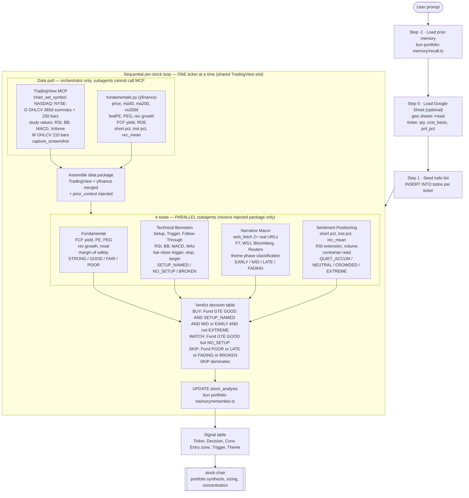

# stocks-advisor

Analyzes individual stocks one at a time — runs a **4-seat analyst panel** (fundamental / technical / narrative / sentiment) per stock and outputs a concrete **entry plan** (price zone + bar-close trigger + market-based stop) with a **BUY / WATCH / SKIP** decision.

Input: user-supplied ticker list, a Google Sheet of holdings, or stocks discovered live from a named market theme.

> Educational analysis, not financial advice. Single stocks are satellites; the index is the bar.

## Architecture



## Two input modes

| Mode | Input | Verdicts |
|---|---|---|
| **Watchlist / Theme discovery** | Explicit tickers or live theme discovery | BUY / WATCH / SKIP |
| **Portfolio review** | Google Sheet URL (holdings + cost basis) | HOLD / ADD / TRIM / EXIT + tax-harvest table |

## The 4 seats

| Seat | Lens | Output |
|---|---|---|
| **Fundamental** | FCF yield, PE, PEG, margins, moat — margin of safety at current price? | STRONG / GOOD / FAIR / POOR |
| **Technical** (Bernstein) | Set-Up → Trigger → Follow-Through. Named setup + bar-close trigger + market-based stop. No trigger = no trade. | SETUP_NAMED / NO_SETUP / BROKEN |
| **Narrative / Macro** | `web_fetch` ≥2 real URLs. Theme phase classification. Verbatim quotes only — no fabrication. | EARLY / MID / LATE / FADING |
| **Sentiment** | Contrarian read: short%, institutional%, analyst consensus, RSI extension | QUIET_ACCUM / NEUTRAL / CROWDED / EXTREME |

## Verdict rules

```
BUY   = Fundamental ≥ GOOD  AND  SETUP_NAMED  AND  phase ∈ {EARLY,MID}  AND  Sentiment ≠ EXTREME
WATCH = Fundamental ≥ GOOD  BUT  NO_SETUP (wait for trigger)
SKIP  = Fundamental = POOR  OR   phase ∈ {LATE,FADING}  OR  Technical = BROKEN
SKIP dominates all other signals.
Conviction 1–5: start at 3, ±1 per alignment signal.
```

## Hard constraints

- **TradingView MCP lives only in the orchestrator** — subagents receive injected data, cannot call MCP.
- **One chart slot** — data pull is strictly sequential, one ticker at a time.
- **ETF / sleeve allocation** → `tradfi-portfolio-manager`. This skill is individual stocks only.
- **Portfolio synthesis** → `stock-chair`. This skill stops at per-name entry plans.

## Layout

| Path | What |
|---|---|
| `SKILL.md` | Full operating instructions |
| `scripts/fundamentals.py` | yfinance data helper — writes `{TICKER}.json.out.json` |
