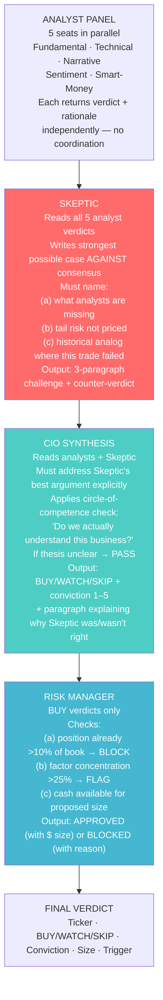
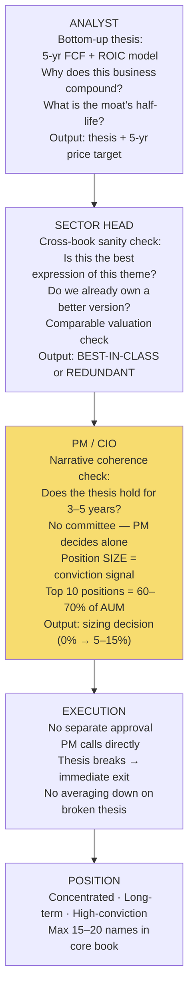
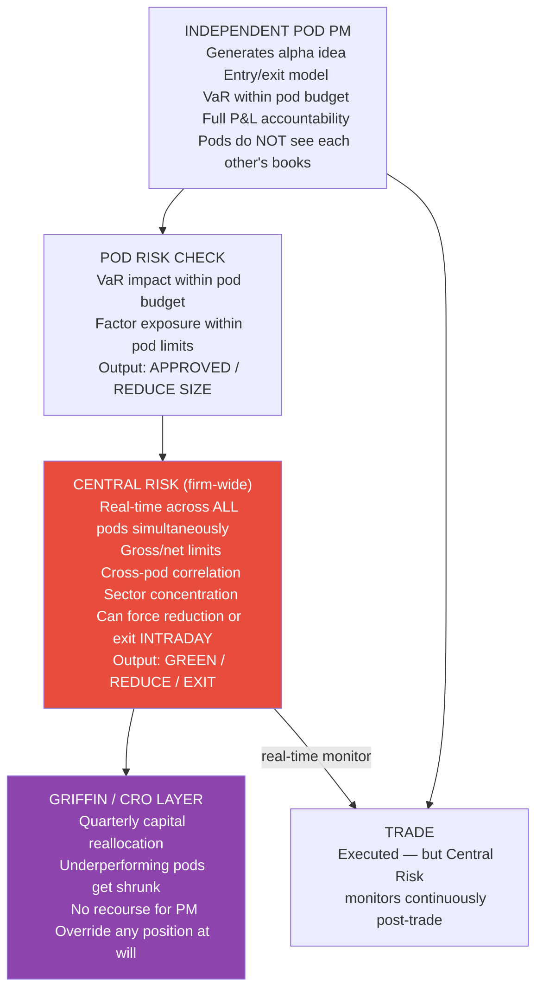
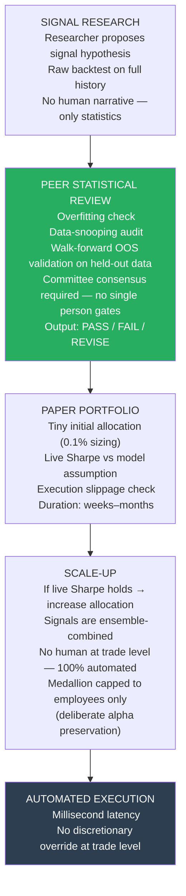
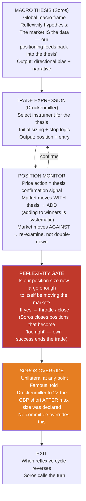
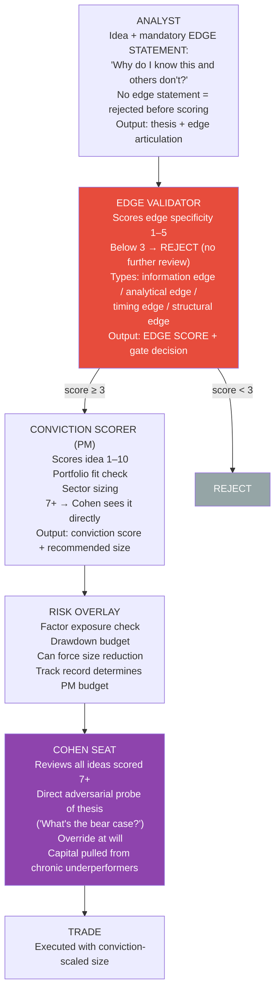

# Hedge Fund Decision Hierarchies

Comparison of investment decision architectures across top funds — for implementation in the stocks-advisor skill.

---

## Bridgewater Associates (Ray Dalio) — *Idea Meritocracy*

**Key principle:** The Skeptic seat is structural — not a human raising their hand, but a dedicated agent whose entire job is to break the consensus thesis. CIO cannot issue a verdict without explicitly addressing the Skeptic's best argument.

---

## Tiger Global / Robertson Cubs — *Concentrated Conviction*

**Key principle:** Position size IS the conviction vote. No formal scoring rubric — if PM believes it, they size it. No committee dilutes the thesis. Faster kill on thesis breaks than any other style.

---

## Citadel (Ken Griffin) — *Multi-Pod with Central Risk*

**Key principle:** Independent pods compete for capital. Central Risk sees everything; pods see nothing of each other. Griffin reallocates capital quarterly — chronic underperformers lose budget, not just positions.

---

## Renaissance Technologies (Simons) — *Pure Quant Signal Committee*

**Key principle:** Statistical threshold is the gate, not a person. No single researcher can push a signal live alone. Signals graduate from 0.1% to full allocation by proving live Sharpe — not by convincing a committee.

---

## Soros / Quantum Fund — *Macro Reflexivity*

**Key principle:** Reflexivity — the fund's own positioning is a market input that can accelerate the thesis. Self-referential feedback is a feature. Soros exits when he's "too right" and his size is itself distorting the market.

---

## Point72 / SAC Capital (Cohen) — *Edge-First + Conviction Scoring*

**Key principle:** Edge articulation is mandatory before any analysis begins. "Why do I know this and others don't?" If the analyst can't answer that question specifically, the idea is rejected. This is what differentiates Point72 from narrative-driven funds.

---

## Comparison Table

| Fund | Seats | Key Gate | Alpha Source | Kill Mechanism | Speed |
|---|---|---|---|---|---|
| **Bridgewater** | Analyst→Skeptic→CIO→Risk | Skeptic must be rebutted | Idea meritocracy | CIO denies on weak rebuttal | Days |
| **Tiger** | Analyst→Sector Head→PM | PM sizing = conviction | 5-yr compound thesis | PM exits on thesis break instantly | Days–weeks |
| **Citadel** | Pod PM→Central Risk→Griffin | Central Risk real-time | Multi-pod diversification | Central Risk intraday force-exit | Minutes–hours |
| **RenTech** | Signal→Peer Review→Paper→Scale | Statistical OOS validation | Ensemble signal alpha | Live Sharpe gate — signal dropped | Milliseconds |
| **Soros** | Macro→Expression→Monitor→Reflex | Soros unilateral override | Macro reflexivity | Soros calls the reflexive reversal | Hours–days |
| **Point72** | Analyst→Edge→Conviction→Risk→Cohen | Edge score ≥ 3 required | Sector specialist + edge | Cohen capital pull from PM | Days |

---

## AI Implementation Priority

| Fund | Ease to implement | Unique value it adds | Recommend? |
|---|---|---|---|
| Bridgewater | ✅ Already done (23/25) | Adversarial Skeptic | **Default — ship it** |
| Point72 | ✅ High | Edge-articulation gate kills weak ideas early | **Next to test** |
| Tiger | ✅ High | Thesis coherence check + concentration filter | **High value** |
| Soros | 🟡 Medium | Reflexivity loop (needs market feedback) | Good for macro skill |
| Citadel | 🟡 Medium | Multi-PM capital competition | Interesting but complex |
| RenTech | ❌ Low | Pure quant — needs real backtested signals | Not applicable to qualitative skill |
