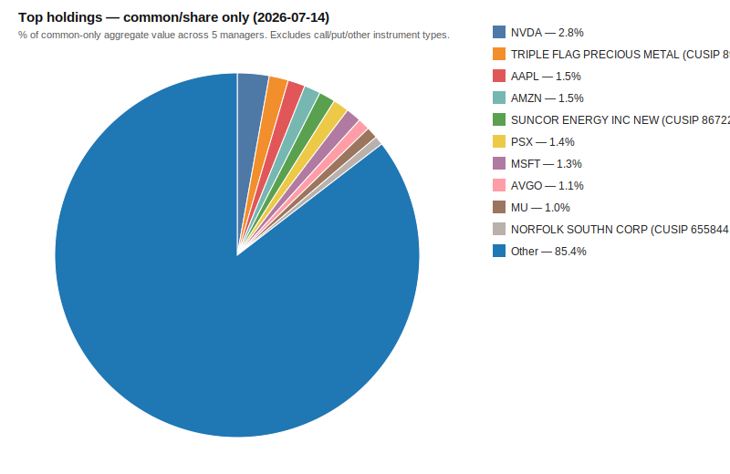

# Top-5 AUM Institutional-Flow Managers — 13F Holdings Report

**Report date:** 2026-07-14  
**Universe (5 funds):** Bridgewater Associates, LP (CIK 0001350694); Citadel Advisors LLC (CIK 0001423053); Millennium Management LLC (CIK 0001273087); Elliott Investment Management L.P. (CIK 0001791786); Man Group plc (CIK 0001637460)  
**Generated at:** 2026-07-14T19:18:20.865Z  
**Status:** ok

> Educational analysis only — not financial advice. This report aggregates PUBLIC SEC Form 13F filings; it is not a recommendation and does not constitute a signal from any single manager.

## Data Sources & Provenance

Primary source: SEC EDGAR (data.sec.gov / www.sec.gov/Archives) — no third-party aggregator used. Per SEC Form 13F rule amendment effective for filings after Jan 2023 (Release No. 34-95064), reported <value> figures are in WHOLE U.S. DOLLARS, not thousands (the pre-2023 convention).

### Bridgewater Associates, LP (CIK 0001350694)

- **Latest filing:** accession `0001350694-26-000002`, report period 2026-03-31, filed 2026-05-15 — [filing index](https://www.sec.gov/Archives/edgar/data/1350694/000135069426000002/0001350694-26-000002-index.html)
  - Reconciliation: ✅ OK — computed 993 rows / $22,404,547,213 vs filer summary 993 rows / $22,404,547,213
- **Prior filing:** accession `0001350694-26-000001`, report period 2025-12-31, filed 2026-02-13 — [filing index](https://www.sec.gov/Archives/edgar/data/1350694/000135069426000001/0001350694-26-000001-index.html)
  - Reconciliation: ✅ OK — computed 1040 rows / $27,421,613,830 vs filer summary 1040 rows / $27,421,613,830

### Citadel Advisors LLC (CIK 0001423053)

- **Latest filing:** accession `0001104659-26-062477`, report period 2026-03-31, filed 2026-05-15 — [filing index](https://www.sec.gov/Archives/edgar/data/1423053/000110465926062477/0001104659-26-062477-index.html)
  - Reconciliation: ✅ OK — computed 15589 rows / $618,473,172,395 vs filer summary 15589 rows / $618,473,172,395
- **Prior filing:** accession `0001104659-26-016408`, report period 2025-12-31, filed 2026-02-17 — [filing index](https://www.sec.gov/Archives/edgar/data/1423053/000110465926016408/0001104659-26-016408-index.html)
  - Reconciliation: ✅ OK — computed 15403 rows / $665,872,168,045 vs filer summary 15403 rows / $665,872,168,045

### Millennium Management LLC (CIK 0001273087)

- **Latest filing:** accession `0001273087-26-000004`, report period 2026-03-31, filed 2026-05-15 — [filing index](https://www.sec.gov/Archives/edgar/data/1273087/000127308726000004/0001273087-26-000004-index.html)
  - Reconciliation: ✅ OK — computed 5624 rows / $240,290,955,946 vs filer summary 5624 rows / $240,290,955,946
- **Prior filing:** accession `0001273087-26-000002`, report period 2025-12-31, filed 2026-02-17 — [filing index](https://www.sec.gov/Archives/edgar/data/1273087/000127308726000002/0001273087-26-000002-index.html)
  - Reconciliation: ✅ OK — computed 5950 rows / $237,791,015,622 vs filer summary 5950 rows / $237,791,015,622

### Elliott Investment Management L.P. (CIK 0001791786)

- **Latest filing:** accession `0001013594-26-000613`, report period 2026-03-31, filed 2026-05-15 — [filing index](https://www.sec.gov/Archives/edgar/data/1791786/000101359426000613/0001013594-26-000613-index.html)
  - Reconciliation: ✅ OK — computed 33 rows / $20,114,693,048 vs filer summary 33 rows / $20,114,693,048
- **Prior filing:** accession `0001013594-26-000272`, report period 2025-12-31, filed 2026-02-18 — [filing index](https://www.sec.gov/Archives/edgar/data/1791786/000101359426000272/0001013594-26-000272-index.html)
  - Reconciliation: ✅ OK — computed 34 rows / $22,594,232,626 vs filer summary 34 rows / $22,594,232,626

### Man Group plc (CIK 0001637460)

- **Latest filing:** accession `0001637460-26-000002`, report period 2026-03-31, filed 2026-05-15 — [filing index](https://www.sec.gov/Archives/edgar/data/1637460/000163746026000002/0001637460-26-000002-index.html)
  - Reconciliation: ✅ OK — computed 3748 rows / $55,119,838,171 vs filer summary 3748 rows / $55,119,838,171
- **Prior filing:** accession `0001637460-26-000001`, report period 2025-12-31, filed 2026-02-17 — [filing index](https://www.sec.gov/Archives/edgar/data/1637460/000163746026000001/0001637460-26-000001-index.html)
  - Reconciliation: ✅ OK — computed 3441 rows / $58,828,069,215 vs filer summary 3441 rows / $58,828,069,215

## Methodology

**Instrument-type classification** (applied per raw `<infoTable>` row before aggregation):

- `<putCall>` present, "Call" (case-insensitive) → `call option`
- `<putCall>` present, "Put" (case-insensitive) → `put option`
- else `<titleOfClass>` (case-insensitive, trimmed) contains "COM" or "ORD", or equals "SH"/"SHS"/"STK" → `common/share`
- else → `other` (preferred stock, notes, units, warrants — never misclassified as common)

**Quarter-over-quarter action definitions** (per manager, on the `(cusip, instrumentType)` key):

- `NEW` = present in current filing for a manager (aggregated value > 0), absent/zero in that manager's prior filing.
- `ADD` = present in both, current > prior (beyond 1% tolerance).
- `TRIM` = present in both, current < prior (beyond 1% tolerance), current still > 0.
- `EXIT` = present (>0) in manager's PRIOR filing, absent/zero in CURRENT filing.
- `UNCHANGED` = present in both, change within tolerance (<1%) — excluded from Top Buys/Sells, not reported as an action.
- Top Buys ranking key = aggregate cross-fund positive dollar delta (sum of NEW+ADD deltas). Top Sells ranking key = aggregate cross-fund negative dollar magnitude (sum of |TRIM delta| + |EXIT prior value|); TRIM and EXIT are always shown as distinct actions per contributing fund, never conflated.

**Weight calculation:** `aggregate_weight_pct` = position's aggregate current value ÷ SUM of aggregate value across ALL consolidated positions (all instrument types combined) in the current report.

**Ticker resolution:** issuer names are matched against SEC's official `company_tickers.json` map after normalizing both sides (uppercase; strip trailing corporate suffixes INC/CORP/CO/LTD/LLC/LP/PLC/THE; strip punctuation; collapse whitespace). Exactly one match → resolved with `ticker_resolution: exact-name-match`. Zero or multiple matches → rendered as `Issuer Name (CUSIP xxxxxxxxx)` with `ticker: null` and `ticker_resolution: unresolved-issuer+cusip` — never fuzzy-matched or hardcoded.

> Options (PUT/CALL) values reported on Form 13F represent the market value of the UNDERLYING shares (notional), not the option contract's own market value/premium — do not use reported option 'value' to infer position size, risk, or directional exposure. A PUT position is a bearish/hedging signal on the underlying and must never be read as a bullish stock call; a CALL position must never be read as equivalent to owning the same dollar amount of common stock.

> Form 13F filings have a 45-day filing lag after quarter-end — holdings reflect stale positions, not real-time exposure.

> Form 13F only covers US-exchange-listed equity securities (and certain equity options) — it excludes non-US securities, most fixed income, cash, and short positions. This report reflects a long-only, US-equity-listed slice of each manager's actual book.

## Consolidated Current Holdings

| Position | Instrument Type | Aggregate Value (USD) | Aggregate Weight % | Funds Holding |
|---|---|---|---|---|
| STATE STR SPDR S&P 500 ETF T (CUSIP 78462F103) | put option | $26,189,842,140 | 2.74% | Citadel Advisors LLC, Millennium Management LLC, Man Group plc |
| INVESCO QQQ TR (CUSIP 46090E103) | put option | $24,265,166,662 | 2.54% | Citadel Advisors LLC, Millennium Management LLC, Elliott Investment Management L.P. |
| STATE STR SPDR S&P 500 ETF T (CUSIP 78462F103) | call option | $18,766,991,448 | 1.96% | Citadel Advisors LLC, Millennium Management LLC, Man Group plc |
| ISHARES TR (CUSIP 464287655) | put option | $15,346,314,400 | 1.60% | Citadel Advisors LLC, Millennium Management LLC, Elliott Investment Management L.P. |
| TSLA | call option | $14,285,609,000 | 1.49% | Citadel Advisors LLC, Millennium Management LLC, Man Group plc |
| NVDA | put option | $13,556,879,360 | 1.42% | Citadel Advisors LLC, Millennium Management LLC, Man Group plc |
| INVESCO QQQ TR (CUSIP 46090E103) | call option | $13,541,104,544 | 1.42% | Citadel Advisors LLC, Millennium Management LLC |
| NVDA | call option | $13,308,184,960 | 1.39% | Citadel Advisors LLC, Millennium Management LLC, Man Group plc |
| ISHARES TR (CUSIP 464287200) | other | $12,901,448,157 | 1.35% | Bridgewater Associates, LP, Citadel Advisors LLC, Millennium Management LLC, Man Group plc |
| TSLA | put option | $11,386,702,500 | 1.19% | Citadel Advisors LLC, Millennium Management LLC, Man Group plc |
| AAPL | call option | $9,695,437,854 | 1.01% | Citadel Advisors LLC, Millennium Management LLC, Man Group plc |
| SPDR GOLD TR (CUSIP 78463V107) | call option | $9,490,562,298 | 0.99% | Citadel Advisors LLC, Millennium Management LLC, Man Group plc |
| META | call option | $8,553,457,926 | 0.89% | Citadel Advisors LLC, Millennium Management LLC, Man Group plc |
| MSFT | call option | $8,380,389,681 | 0.88% | Citadel Advisors LLC, Millennium Management LLC, Man Group plc |
| NVDA | common/share | $7,677,356,925 | 0.80% | Bridgewater Associates, LP, Citadel Advisors LLC, Millennium Management LLC, Man Group plc |
| META | put option | $7,221,253,221 | 0.76% | Citadel Advisors LLC, Millennium Management LLC, Man Group plc |
| AAPL | put option | $7,155,685,187 | 0.75% | Citadel Advisors LLC, Millennium Management LLC, Man Group plc |
| MSFT | put option | $6,778,627,074 | 0.71% | Citadel Advisors LLC, Millennium Management LLC, Man Group plc |
| ISHARES TR (CUSIP 464287655) | call option | $6,713,682,400 | 0.70% | Citadel Advisors LLC, Millennium Management LLC |
| AMZN | call option | $6,389,723,600 | 0.67% | Citadel Advisors LLC, Millennium Management LLC, Man Group plc |
| ALPHABET INC (CUSIP 02079K305) | put option | $6,372,645,916 | 0.67% | Citadel Advisors LLC, Millennium Management LLC, Man Group plc |
| MU | put option | $6,309,162,000 | 0.66% | Citadel Advisors LLC, Millennium Management LLC, Man Group plc |
| AMZN | put option | $6,219,171,297 | 0.65% | Citadel Advisors LLC, Millennium Management LLC, Man Group plc |
| ALPHABET INC (CUSIP 02079K305) | call option | $5,832,061,872 | 0.61% | Citadel Advisors LLC, Millennium Management LLC, Man Group plc |
| SPDR GOLD TR (CUSIP 78463V107) | put option | $5,380,432,218 | 0.56% | Citadel Advisors LLC, Millennium Management LLC, Man Group plc |
| ISHARES TR (CUSIP 464288513) | put option | $5,217,767,568 | 0.55% | Citadel Advisors LLC, Millennium Management LLC, Elliott Investment Management L.P. |
| NFLX | put option | $4,749,838,845 | 0.50% | Citadel Advisors LLC, Millennium Management LLC, Man Group plc |
| TRIPLE FLAG PRECIOUS METAL (CUSIP 89679M104) | common/share | $4,635,904,717 | 0.48% | Bridgewater Associates, LP, Citadel Advisors LLC, Millennium Management LLC, Elliott Investment Management L.P., Man Group plc |
| AAPL | common/share | $4,171,985,794 | 0.44% | Bridgewater Associates, LP, Citadel Advisors LLC, Millennium Management LLC, Man Group plc |
| MU | call option | $3,983,910,632 | 0.42% | Citadel Advisors LLC, Millennium Management LLC, Man Group plc |
| AMZN | common/share | $3,960,314,656 | 0.41% | Bridgewater Associates, LP, Citadel Advisors LLC, Millennium Management LLC, Man Group plc |
| SUNCOR ENERGY INC NEW (CUSIP 867224107) | common/share | $3,918,098,118 | 0.41% | Bridgewater Associates, LP, Citadel Advisors LLC, Millennium Management LLC, Elliott Investment Management L.P., Man Group plc |
| PSX | common/share | $3,859,121,856 | 0.40% | Bridgewater Associates, LP, Citadel Advisors LLC, Millennium Management LLC, Elliott Investment Management L.P., Man Group plc |
| AMD | put option | $3,689,406,480 | 0.39% | Citadel Advisors LLC, Millennium Management LLC, Man Group plc |
| MSFT | common/share | $3,672,438,801 | 0.38% | Bridgewater Associates, LP, Citadel Advisors LLC, Millennium Management LLC, Man Group plc |
| AVGO | put option | $3,562,181,541 | 0.37% | Citadel Advisors LLC, Millennium Management LLC, Man Group plc |
| AVGO | call option | $3,534,294,690 | 0.37% | Citadel Advisors LLC, Millennium Management LLC, Man Group plc |
| TAIWAN SEMICONDUCTOR MANUFAC (CUSIP 874039100) | put option | $3,510,286,650 | 0.37% | Citadel Advisors LLC, Millennium Management LLC |
| STATE STR SPDR S&P 500 ETF T (CUSIP 78462F103) | other | $3,469,927,439 | 0.36% | Bridgewater Associates, LP, Citadel Advisors LLC, Millennium Management LLC |
| ALPHABET INC (CUSIP 02079K107) | call option | $3,409,101,612 | 0.36% | Citadel Advisors LLC, Millennium Management LLC |
| AMD | call option | $3,181,787,601 | 0.33% | Citadel Advisors LLC, Millennium Management LLC, Man Group plc |
| ISHARES SILVER TR (CUSIP 46428Q109) | call option | $3,174,690,298 | 0.33% | Citadel Advisors LLC, Millennium Management LLC, Man Group plc |
| PLTR | call option | $3,168,571,080 | 0.33% | Citadel Advisors LLC, Millennium Management LLC, Man Group plc |
| SELECT SECTOR SPDR TR (CUSIP 81369Y605) | put option | $3,064,450,207 | 0.32% | Citadel Advisors LLC, Millennium Management LLC, Man Group plc |
| GOLDMAN SACHS GROUP INC (CUSIP 38141G104) | call option | $2,985,329,512 | 0.31% | Citadel Advisors LLC, Millennium Management LLC, Man Group plc |
| META | other | $2,965,443,045 | 0.31% | Bridgewater Associates, LP, Citadel Advisors LLC, Millennium Management LLC, Man Group plc |
| AVGO | common/share | $2,896,110,450 | 0.30% | Bridgewater Associates, LP, Citadel Advisors LLC, Millennium Management LLC, Man Group plc |
| NFLX | call option | $2,878,231,020 | 0.30% | Citadel Advisors LLC, Millennium Management LLC, Man Group plc |
| TAIWAN SEMICONDUCTOR MANUFAC (CUSIP 874039100) | other | $2,856,583,544 | 0.30% | Bridgewater Associates, LP, Citadel Advisors LLC, Millennium Management LLC, Man Group plc |
| ALPHABET INC (CUSIP 02079K107) | put option | $2,809,678,956 | 0.29% | Citadel Advisors LLC, Millennium Management LLC |

_13864 more positions in the JSON sidecar._

## Top Buys (Q/Q) — top 10

> 'Acting-Funds Current/Prior Value' below sum ONLY the funds that took a NEW/ADD/TRIM/EXIT action on that position this quarter — funds holding the position UNCHANGED are excluded by definition. This is NOT the position's total consolidated holding value across all funds; see the Aggregate Value column in Consolidated Current Holdings above for that full cross-fund total.

| Position | Instrument Type | Acting-Funds Current Value | Acting-Funds Prior Value | $ Delta | % Delta | Contributing Funds |
|---|---|---|---|---|---|---|
| STATE STR SPDR S&P 500 ETF T (CUSIP 78462F103) | put option | $24,186,274,668 | $19,744,311,680 | $4,441,962,988 | +22.5% | Citadel Advisors LLC: ADD ($4,441,962,988) |
| ISHARES TR (CUSIP 464287200) | other | $2,652,522,508 | $50,904,741 | $2,601,617,767 | +5110.8% | Citadel Advisors LLC: ADD ($2,601,617,767) |
| ISHARES TR (CUSIP 464287655) | put option | $10,085,961,600 | $7,551,819,560 | $2,534,142,040 | +33.6% | Millennium Management LLC: ADD ($2,410,142,040); Elliott Investment Management L.P.: NEW ($124,000,000) |
| MU | put option | $6,309,162,000 | $3,944,309,118 | $2,364,852,882 | +60.0% | Citadel Advisors LLC: ADD ($2,142,298,853); Millennium Management LLC: ADD ($214,223,054); Man Group plc: ADD ($8,330,975) |
| SNDK | call option | $2,335,699,807 | $349,629,881 | $1,986,069,926 | +568.0% | Citadel Advisors LLC: ADD ($1,894,405,026); Millennium Management LLC: ADD ($87,979,928); Man Group plc: NEW ($3,684,972) |
| SPDR GOLD TR (CUSIP 78463V107) | call option | $9,433,333,728 | $7,570,313,620 | $1,863,020,108 | +24.6% | Citadel Advisors LLC: ADD ($1,858,243,889); Man Group plc: NEW ($4,776,219) |
| SPDR SERIES TRUST (CUSIP 78464A854) | other | $1,650,675,570 | $0 | $1,650,675,570 | NEW | Millennium Management LLC: NEW ($1,650,675,570) |
| MU | call option | $3,983,910,632 | $2,581,561,991 | $1,402,348,641 | +54.3% | Citadel Advisors LLC: ADD ($1,187,880,129); Millennium Management LLC: ADD ($205,124,017); Man Group plc: ADD ($9,344,495) |
| CRH PLC (CUSIP G25508105) | put option | $1,364,456,976 | $4,530,240 | $1,359,926,736 | +30018.9% | Millennium Management LLC: ADD ($1,359,926,736) |
| SNDK | put option | $1,645,031,858 | $302,978,776 | $1,342,053,082 | +443.0% | Citadel Advisors LLC: ADD ($1,262,441,490); Millennium Management LLC: ADD ($77,070,232); Man Group plc: NEW ($2,541,360) |

## Top Sells (Q/Q) — top 10

> 'Acting-Funds Current/Prior Value' below sum ONLY the funds that took a NEW/ADD/TRIM/EXIT action on that position this quarter — funds holding the position UNCHANGED are excluded by definition. This is NOT the position's total consolidated holding value across all funds; see the Aggregate Value column in Consolidated Current Holdings above for that full cross-fund total.

| Position | Instrument Type | Acting-Funds Current Value | Acting-Funds Prior Value | $ Delta | % Delta | Contributing Funds |
|---|---|---|---|---|---|---|
| TSLA | call option | $14,285,609,000 | $20,487,759,124 | $-6,202,150,124 | -30.3% | Citadel Advisors LLC: TRIM ($-6,131,236,722); Millennium Management LLC: TRIM ($-69,789,668); Man Group plc: TRIM ($-1,123,734) |
| TSLA | put option | $9,561,484,350 | $14,563,012,928 | $-5,001,528,578 | -34.3% | Citadel Advisors LLC: TRIM ($-5,000,404,844); Man Group plc: TRIM ($-1,123,734) |
| WMT | common/share | $319,263,017 | $5,103,437,862 | $-4,784,174,845 | -93.7% | Citadel Advisors LLC: TRIM ($-332,034,870); Millennium Management LLC: TRIM ($-4,424,490,030); Man Group plc: TRIM ($-27,649,945) |
| INVESCO QQQ TR (CUSIP 46090E103) | put option | $24,265,166,662 | $28,523,396,196 | $-4,258,229,534 | -14.9% | Citadel Advisors LLC: TRIM ($-1,700,964,256); Millennium Management LLC: TRIM ($-1,866,672,278); Elliott Investment Management L.P.: TRIM ($-690,593,000) |
| STATE STR SPDR S&P 500 ETF T (CUSIP 78462F103) | other | $3,469,927,439 | $7,418,849,762 | $-3,948,922,323 | -53.2% | Bridgewater Associates, LP: TRIM ($-199,590,880); Citadel Advisors LLC: TRIM ($-1,248,171,779); Millennium Management LLC: TRIM ($-2,081,877,060); Man Group plc: EXIT ($-419,282,604) |
| INVESCO QQQ TR (CUSIP 46090E103) | call option | $11,252,874,434 | $14,441,076,618 | $-3,188,202,184 | -22.1% | Citadel Advisors LLC: TRIM ($-2,573,892,184); Elliott Investment Management L.P.: EXIT ($-614,310,000) |
| ISHARES TR (CUSIP 464287200) | other | $10,248,925,649 | $13,165,048,175 | $-2,916,122,526 | -22.2% | Bridgewater Associates, LP: TRIM ($-1,116,872,869); Millennium Management LLC: TRIM ($-1,445,252,436); Man Group plc: TRIM ($-353,997,221) |
| NVDA | call option | $11,665,267,200 | $14,535,492,950 | $-2,870,225,750 | -19.7% | Citadel Advisors LLC: TRIM ($-2,870,225,750) |
| META | call option | $8,461,287,783 | $10,818,941,109 | $-2,357,653,326 | -21.8% | Citadel Advisors LLC: TRIM ($-2,311,313,532); Millennium Management LLC: TRIM ($-46,339,794) |
| AMZN | common/share | $3,046,277,816 | $5,270,469,556 | $-2,224,191,740 | -42.2% | Citadel Advisors LLC: TRIM ($-1,576,041,905); Millennium Management LLC: TRIM ($-254,307,437); Man Group plc: TRIM ($-393,842,398) |

## Pie Chart — Top Holdings (common/share only)

Common/share only, top-10 + Other, % of common-only total ($272,839,304,690) across 5 funds, as of 2026-07-14.

## Missing Data / Warnings

**Warnings:**

- citadel (2026-03-31): implausible per-share price ($0.01) for "GABELLI EQUITY TR INC" (CUSIP 362397226) — verify units
- citadel (2026-03-31): implausible per-share price ($0.01) for "REVELATION BIOSCIENCES INC" (CUSIP 76135L119) — verify units
- citadel (2026-03-31): implausible per-share price ($0.01) for "TENON MEDICAL INC" (CUSIP 88066N113) — verify units
- citadel (2026-03-31): implausible per-share price ($0.00) for "XOS INC" (CUSIP 98423B116) — verify units
- citadel (2025-12-31): implausible per-share price ($0.00) for "MOOLEC SCIENCE SA" (CUSIP G6223S117) — verify units
- citadel (2025-12-31): implausible per-share price ($0.01) for "REVELATION BIOSCIENCES INC" (CUSIP 76135L119) — verify units
- citadel (2025-12-31): implausible per-share price ($0.00) for "XOS INC" (CUSIP 98423B116) — verify units
- millennium (2026-03-31): implausible per-share price ($0.01) for "CDT  EQUITY    INC" (CUSIP 20678X114) — verify units
- millennium (2026-03-31): implausible per-share price ($0.01) for "GDEV   INC" (CUSIP G6529J118) — verify units
- millennium (2026-03-31): implausible per-share price ($0.01) for "GENEDX  HOLDINGS     CORP" (CUSIP 81663L119) — verify units
- millennium (2026-03-31): implausible per-share price ($0.01) for "GOGORO     INC" (CUSIP G9491K113) — verify units
- millennium (2026-03-31): implausible per-share price ($0.00) for "KATAPULT    HOLDINGS      INC" (CUSIP 485859110) — verify units
- millennium (2026-03-31): implausible per-share price ($0.00) for "ORIGIN   MATERIALS      INC" (CUSIP 68622D114) — verify units
- millennium (2026-03-31): implausible per-share price ($0.01) for "P3  HEALTH    PARTNERS    INC" (CUSIP 744413113) — verify units
- millennium (2026-03-31): implausible per-share price ($0.01) for "RENEW   ENERGY   GLOBAL     PLC" (CUSIP G7500M120) — verify units
- millennium (2026-03-31): implausible per-share price ($0.01) for "STRATA  CRITICAL   MEDICAL    INC" (CUSIP 092667112) — verify units
- millennium (2026-03-31): implausible per-share price ($0.01) for "SWVL   HOLDINGS      CORP" (CUSIP G86302117) — verify units
- millennium (2026-03-31): implausible per-share price ($0.01) for "TABOOLA.COM      LTD" (CUSIP M8744T114) — verify units
- millennium (2026-03-31): implausible per-share price ($0.00) for "TALKSPACE     INC" (CUSIP 87427V111) — verify units
- millennium (2026-03-31): implausible per-share price ($0.00) for "XOS   INC" (CUSIP 98423B116) — verify units
- millennium (2025-12-31): implausible per-share price ($0.01) for "CARBON   REVOLUTION     LTD" (CUSIP G1893D110) — verify units
- millennium (2025-12-31): implausible per-share price ($0.01) for "CDT  EQUITY   INC" (CUSIP 20678X114) — verify units
- millennium (2025-12-31): implausible per-share price ($0.01) for "GOGORO     INC" (CUSIP G9491K113) — verify units
- millennium (2025-12-31): implausible per-share price ($0.01) for "INSPIRATO     INCORPORATED" (CUSIP 45791E115) — verify units
- millennium (2025-12-31): implausible per-share price ($0.00) for "KATAPULT   HOLDINGS        INC" (CUSIP 485859110) — verify units
- millennium (2025-12-31): implausible per-share price ($0.00) for "ORIGIN   MATERIALS         INC" (CUSIP 68622D114) — verify units
- millennium (2025-12-31): implausible per-share price ($0.01) for "P3   HEALTH   PARTNERS    INC" (CUSIP 744413113) — verify units
- millennium (2025-12-31): implausible per-share price ($0.00) for "PAYSAFE    LIMITED" (CUSIP G6964L115) — verify units
- millennium (2025-12-31): implausible per-share price ($0.00) for "RAIN   ENHANCEMENT         TECHNOLOGIE" (CUSIP 75080J111) — verify units
- millennium (2025-12-31): implausible per-share price ($0.01) for "RENEW   ENERGY    GLOBAL      PLC" (CUSIP G7500M120) — verify units
- millennium (2025-12-31): implausible per-share price ($0.01) for "SWVL   HOLDINGS       CORP" (CUSIP G86302117) — verify units
- millennium (2025-12-31): implausible per-share price ($0.00) for "XOS   INC" (CUSIP 98423B116) — verify units

## Sources

- https://data.sec.gov/submissions/CIK0001273087.json
- https://data.sec.gov/submissions/CIK0001350694.json
- https://data.sec.gov/submissions/CIK0001423053.json
- https://data.sec.gov/submissions/CIK0001637460.json
- https://data.sec.gov/submissions/CIK0001791786.json
- https://www.sec.gov/Archives/edgar/data/1273087/000127308726000002/MLP_Filing_20251231_v1.xml
- https://www.sec.gov/Archives/edgar/data/1273087/000127308726000002/index.json
- https://www.sec.gov/Archives/edgar/data/1273087/000127308726000002/primary_doc.xml
- https://www.sec.gov/Archives/edgar/data/1273087/000127308726000004/MLP_FIling_20260331.xml
- https://www.sec.gov/Archives/edgar/data/1273087/000127308726000004/index.json
- https://www.sec.gov/Archives/edgar/data/1273087/000127308726000004/primary_doc.xml
- https://www.sec.gov/Archives/edgar/data/1350694/000135069426000001/index.json
- https://www.sec.gov/Archives/edgar/data/1350694/000135069426000001/infotable.xml
- https://www.sec.gov/Archives/edgar/data/1350694/000135069426000001/primary_doc.xml
- https://www.sec.gov/Archives/edgar/data/1350694/000135069426000002/index.json
- https://www.sec.gov/Archives/edgar/data/1350694/000135069426000002/infotable.xml
- https://www.sec.gov/Archives/edgar/data/1350694/000135069426000002/primary_doc.xml
- https://www.sec.gov/Archives/edgar/data/1423053/000110465926016408/index.json
- https://www.sec.gov/Archives/edgar/data/1423053/000110465926016408/infotable.xml
- https://www.sec.gov/Archives/edgar/data/1423053/000110465926016408/primary_doc.xml
- https://www.sec.gov/Archives/edgar/data/1423053/000110465926062477/index.json
- https://www.sec.gov/Archives/edgar/data/1423053/000110465926062477/infotable.xml
- https://www.sec.gov/Archives/edgar/data/1423053/000110465926062477/primary_doc.xml
- https://www.sec.gov/Archives/edgar/data/1637460/000163746026000001/index.json
- https://www.sec.gov/Archives/edgar/data/1637460/000163746026000001/infotable.xml
- https://www.sec.gov/Archives/edgar/data/1637460/000163746026000001/primary_doc.xml
- https://www.sec.gov/Archives/edgar/data/1637460/000163746026000002/index.json
- https://www.sec.gov/Archives/edgar/data/1637460/000163746026000002/infotable.xml
- https://www.sec.gov/Archives/edgar/data/1637460/000163746026000002/primary_doc.xml
- https://www.sec.gov/Archives/edgar/data/1791786/000101359426000272/form13fInfoTable.xml
- https://www.sec.gov/Archives/edgar/data/1791786/000101359426000272/index.json
- https://www.sec.gov/Archives/edgar/data/1791786/000101359426000272/primary_doc.xml
- https://www.sec.gov/Archives/edgar/data/1791786/000101359426000613/form13fInfoTable.xml
- https://www.sec.gov/Archives/edgar/data/1791786/000101359426000613/index.json
- https://www.sec.gov/Archives/edgar/data/1791786/000101359426000613/primary_doc.xml
- https://www.sec.gov/files/company_tickers.json
